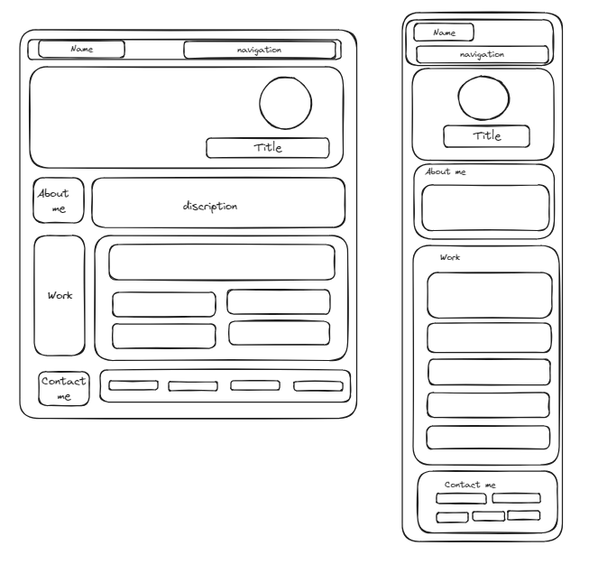
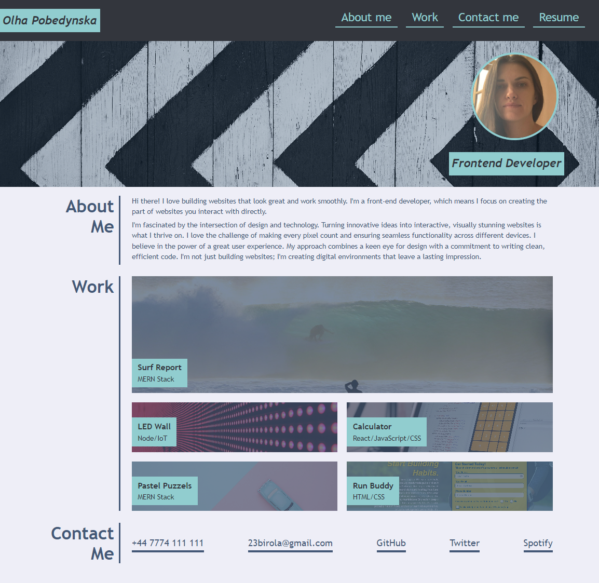

# bootstrap-portfolio

## Description

I'd like to represent you my portfolio, which showcase my skills, work samples and contact information. Developing this project I was using HTML, CSS, GitHub, Bootstrap and excalidraw.

**Here is the project outline**

**Here is the link to this project** https://23birola.github.io/bootstrap-portfolio/

**Here is the project screenshot**

## License

This project is licensed under the MIT License. For details, please see the LICENSE file. 
